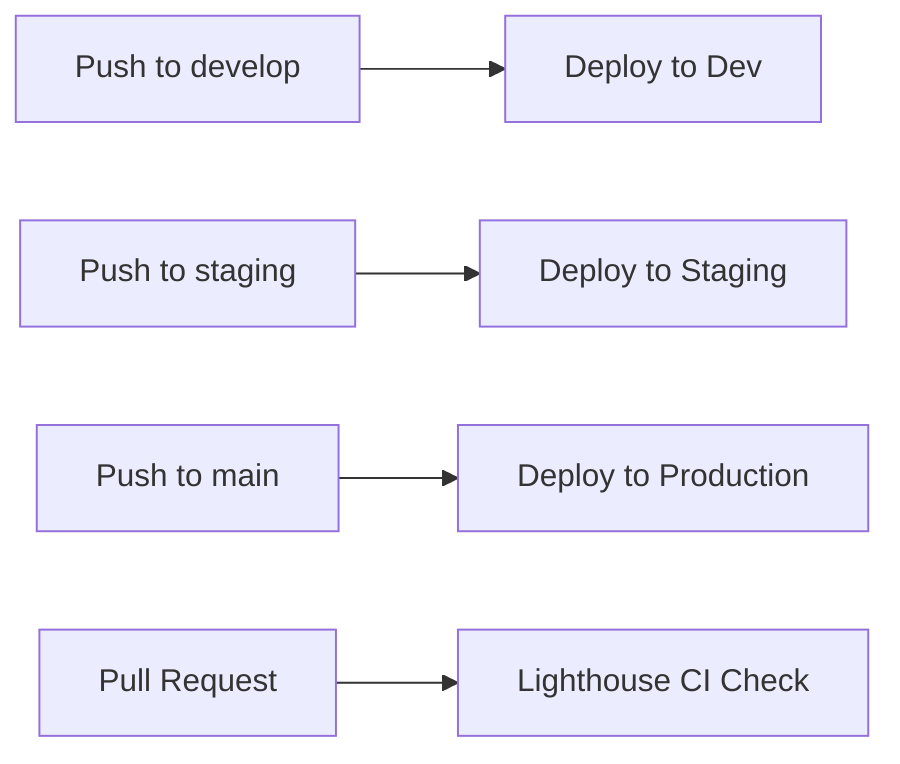

# Angular Release & Deployment Frontend

A production-ready Angular 21 application demonstrating enterprise-grade deployment, CI/CD, performance monitoring, and build optimization.

## Project Overview

This project showcases a complete Angular application lifecycle from development to production deployment on AWS S3 + CloudFront with automated CI/CD pipelines.

### Key Features

- ✅ **Multi-Environment Deployment** (Dev, QA, Staging, Production)
- ✅ **Automated CI/CD** via GitHub Actions
- ✅ **Performance Monitoring** (Lighthouse CI + Web Vitals)
- ✅ **Build Optimization** (65 KB gzipped, lazy loading, tree shaking)
- ✅ **Release Management** (Semantic versioning, automated changelogs)
- ✅ **Runtime Configuration** (Same build → all environments)
- ✅ **Git Workflow** (Feature branches, protected main, PR-based)

---

## Quick Start

### Prerequisites

- Node.js 20.x+
- npm 10.x+
- AWS Account (for deployment)
- GitHub Account (for CI/CD)

### Local Development

```bash
# Install dependencies
npm install

# Start development server
npm start

# Open http://localhost:4200
```

### Build for Production

```bash
# Production build
npm run build

# Build with stats
npm run build:stats

# Analyze bundle
npm run analyze
```

---

## Project Structure

```
angular-release-deployment-frontend/
├── .github/
│   └── workflows/
│       ├── deploy-s3.yml              # Multi-environment deployment
│       └── performance-check.yml       # Lighthouse CI on PRs
├── src/
│   ├── app/
│   │   ├── core/
│   │   │   └── services/
│   │   │       ├── config.service.ts         # Runtime config
│   │   │       └── performance.service.ts    # Web Vitals
│   │   └── features/
│   │       └── dashboard/                     # Lazy-loaded module
│   ├── assets/
│   │   └── config/
│   │       └── config.{env}.json      # Environment configs
│   └── environments/
├── public/
│   └── config/
│       └── config.{env}.json          # Deployed configs
├── analyze-bundle.mjs                 # Bundle analyzer
├── build-stats.mjs                    # Build performance
├── lighthouserc.json                  # Lighthouse CI config
└── IMPLEMENTATION-CHECKLIST.md        # Complete setup guide
```

---

## Deployment

### Environments

| Environment | URL | Trigger |
|-------------|-----|---------|
| **Development** | [S3 Link](http://angular-deploy-dev-shree-1767366539.s3-website-us-east-1.amazonaws.com) | Push to `develop` |
| **QA** | [S3 Link](http://angular-deploy-qa-shree-1767366539.s3-website-us-east-1.amazonaws.com) | Manual trigger |
| **Staging** | [S3 Link](http://angular-deploy-staging-shree-1767366539.s3-website-us-east-1.amazonaws.com) | Push to `staging` |
| **Production** | [CloudFront HTTPS](https://d29lgch8cdh74n.cloudfront.net) | Push to `main` |

### Deployment Commands

```bash
# Emergency manual deployments only
npm run deploy:dev
npm run deploy:qa
npm run deploy:staging
npm run deploy:prod

# Production deployments should use GitHub Actions
```

---

## Available Scripts

| Command | Description |
|---------|-------------|
| `npm start` | Start development server (port 4200) |
| `npm run build` | Production build |
| `npm run analyze` | Bundle composition analysis |
| `npm run build:stats` | Build performance report |
| `npm test` | Run unit tests (Vitest) |
| `npm run lint` | Run ESLint |
| `npm run lint:fix` | Fix linting issues |
| `npm run format` | Format code with Prettier |

---

## Performance

### Metrics

| Metric | Value | Status |
|--------|-------|--------|
| **Bundle Size** (gzipped) | 65.66 KB | ✅ |
| **Lighthouse Score** | 90+ | ✅ |
| **LCP** | < 2.5s | ✅ |
| **FCP** | < 1.8s | ✅ |
| **CLS** | < 0.1 | ✅ |
| **Build Time** | ~3 seconds | ✅ |

### Monitoring

- **Web Vitals**: Real user performance tracking
- **Lighthouse CI**: Automated testing on every PR
- **Performance Budgets**: Enforced in CI/CD

---

## Documentation

### Comprehensive Guides

- [IMPLEMENTATION-CHECKLIST.md](IMPLEMENTATION-CHECKLIST.md) - Complete setup walkthrough
- [PERFORMANCE-GUIDE.md](PERFORMANCE-GUIDE.md) - Performance optimization guide
- [AWS-DEPLOYMENT-GUIDE.md](AWS-DEPLOYMENT-GUIDE.md) - AWS deployment steps
- [CICD-SETUP-GUIDE.md](CICD-SETUP-GUIDE.md) - CI/CD configuration
- [DEPLOYMENT-WORKFLOW-MENTAL-MODEL.md](DEPLOYMENT-WORKFLOW-MENTAL-MODEL.md) - How deployments work
- [PHASES-6-TO-15-SUMMARY.md](PHASES-6-TO-15-SUMMARY.md) - Advanced phases roadmap

### Quick References

- [GIT-WORKFLOW.md](GIT-WORKFLOW.md) - Git branching strategy
- [GITHUB-ACTIONS-MONITORING-GUIDE.md](GITHUB-ACTIONS-MONITORING-GUIDE.md) - Monitor CI/CD
- [AWS-KNOWLEDGE-GUIDE.md](AWS-KNOWLEDGE-GUIDE.md) - AWS concepts explained

---

## Implementation Phases

### ✅ Completed Phases

1. **Phase 1**: Frontend Project Foundation
2. **Phase 2**: Runtime Environment Configuration
3. **Phase 3**: Git Workflow Setup
4. **Phase 4A**: AWS S3 + CloudFront Deployment
5. **Phase 5**: CI/CD Automation (GitHub Actions)
6. **Phase 6**: Release Management (Tagging, Changelogs)
7. **Phase 8**: Performance Monitoring (Lighthouse + Web Vitals)
8. **Phase 10**: Advanced Build Optimization

### ❌ Skipped Phases (Optional)

- **Phase 4B**: Docker Deployment
- **Phase 7**: Blue-Green/Canary Deployments
- **Phase 9**: Security Hardening (Angular built-in sufficient)
- **Phase 11**: Advanced Monitoring (Sentry, CloudWatch RUM)
- **Phase 12**: Testing Strategy (Unit/E2E tests)
- **Phase 13**: Progressive Web App (PWA)
- **Phase 14**: Internationalization (i18n)
- **Phase 15**: Advanced Security (duplicate of Phase 9)

**Project Completion**: ~75% (core features complete)

See [PHASES-6-TO-15-SUMMARY.md](PHASES-6-TO-15-SUMMARY.md) for detailed roadmap of skipped phases.

---

## Technology Stack

### Frontend
- **Framework**: Angular 21
- **Language**: TypeScript 5.9
- **Build Tool**: esbuild (via @angular/build)
- **Styling**: SCSS
- **Linting**: ESLint + Prettier
- **Testing**: Vitest

### Infrastructure
- **Hosting**: AWS S3 (static hosting)
- **CDN**: AWS CloudFront (HTTPS, global distribution)
- **CI/CD**: GitHub Actions
- **Deployment**: Automated multi-environment

### Performance
- **Bundle Size**: 65 KB (gzipped)
- **Lazy Loading**: Feature modules
- **Tree Shaking**: Enabled
- **Source Maps**: Production debugging

---

## CI/CD Pipeline

### Workflow Triggers



### Performance Checks

- ✅ Lighthouse CI runs on every PR
- ✅ Performance scores posted as PR comments
- ✅ Blocks merge if budgets violated
- ✅ Automated test reports

---

## Configuration

### Environment Files

```
public/config/
├── config.dev.json        # Development
├── config.qa.json         # QA
├── config.staging.json    # Staging
└── config.prod.json       # Production
```

### Runtime Configuration

The app loads configuration at runtime (not build time):

```typescript
// Same build deployed to all environments
// Configuration loaded from /config/config.{env}.json

{
  "name": "production",
  "production": true,
  "apiUrl": "https://api.example.com"
}
```

---

## Git Workflow

### Branch Strategy

- `main` → Production (protected)
- `staging` → Staging environment
- `develop` → Development environment
- `feature/*` → Feature branches (PR to develop)
- `hotfix/*` → Emergency fixes (PR to main)

### Commit Convention

```bash
feat: add new feature
fix: resolve bug
docs: update documentation
chore: update dependencies
perf: improve performance
refactor: code restructuring
```

---

## Contributing

### Development Workflow

1. Create feature branch from `develop`
```bash
git checkout develop
git pull origin develop
git checkout -b feature/my-feature
```

2. Make changes and commit
```bash
git add .
git commit -m "feat: add my feature"
```

3. Push and create PR
```bash
git push origin feature/my-feature
# Create PR on GitHub: feature/my-feature → develop
```

4. Wait for checks to pass
- ✅ Lighthouse CI
- ✅ Linting
- ✅ Build succeeds

5. Merge after approval

---

## License

This project is for educational purposes.

---

## Support

For questions or issues, refer to:
- [IMPLEMENTATION-CHECKLIST.md](IMPLEMENTATION-CHECKLIST.md) - Step-by-step guide
- [Documentation](#documentation) - All guides listed above
- GitHub Issues - Report bugs/questions

---

**Last Updated**: 2026-01-03
**Version**: 1.0.0
**Status**: Production Ready (Core Features Complete)
**Angular**: 21.0.4
**Node**: 20.x+

---

## Next Steps

1. **Push to GitHub**: Commit all changes
2. **Create PR**: Test lighthouse-test → develop
3. **Verify CI/CD**: Check GitHub Actions
4. **Deploy**: Merge to environments
5. **Monitor**: Check Lighthouse scores

See [IMPLEMENTATION-CHECKLIST.md](IMPLEMENTATION-CHECKLIST.md) for detailed next steps.
